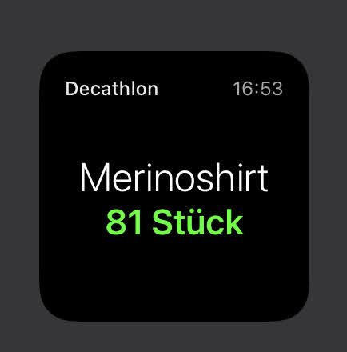
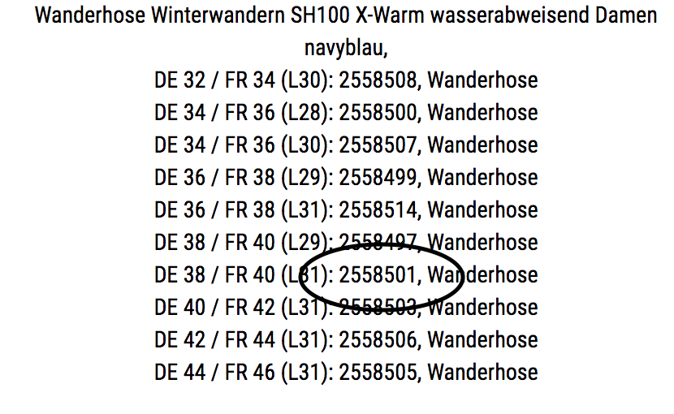

# Availability-Widget (with Scriptable)

 

The Availability-Widget allows you to create [Scriptable](https://scriptable.app/) widgets on your iOS smartphone to see the availabilty of specific producs (e.g. from Decathlon-Shop).

## Widget-Configuration

Each widget can be given the SKU (stock keeping unit) of a product whose availability is to be displayed on the smartphone.

In addition, a name for the display can be defined for the respective SKU.


### Examples:

````
1460651,Poloshirt

702282,Shirt

1460651,Golfshirt

2619305,Scooter
````


### What is a sku and how to find it?

For each product and each size/colour of this product, there is an internal SKU (stock keeping unit) in the online shop that represents this combination.
Prices and availability are managed internally in the shop using these SKUs. Therefore, the respective SKU is required for the display of availabilities.

You might ask yourself how to get the SKU number of a product, e.g. within the Decathlon online shop?

  Product example: https://www.decathlon.de/search?Ntt=2558501

The SKUs of the combinations are stored within each HTML code of the product pages in the form of JSON objects. Theoretically, you can search for them yourself.

Or you can use the bookmarklet (in this case created for the Decathlon shop as an example).
This bookmarklet extracts the data and then displays this data at the top of the page with the associated additional information of the variants:



Here is the bookmarklet: [DecathlonSKUs](DecathlonBookmarklet.js) / [DecathlonSKUs-minified](DecathlonBookmarklet.min.js)

(Minified with the service of: https://neurotechnics.com/tools/jsmin )

### Caching

The caching of the retrieved data is done by default for 60 minutes at a time.

During this time, there are no requests to the retrieved website.

If there is no internet connection, the data is cached by default for 24 hours.

These times were chosen because a more frequent update would make only limited sense and because the services are therefore not overloaded.


## Features

* real caching (default: 60 minutes) => no (!) outgoing requests during this time
* display of the time of the last update
* Notification if stock has increased since last request
* Click on widget (if "open app" is selected in Config) opens product page of shop (in browser)
* Bookmarklet for browser to create config string for the widgets


## Bugs and Feedback 

If you find any bugs please message me. Feel free to poste your issues to this repository.


## Support


Thanks for visiting or trying out this Availability-Widget!
